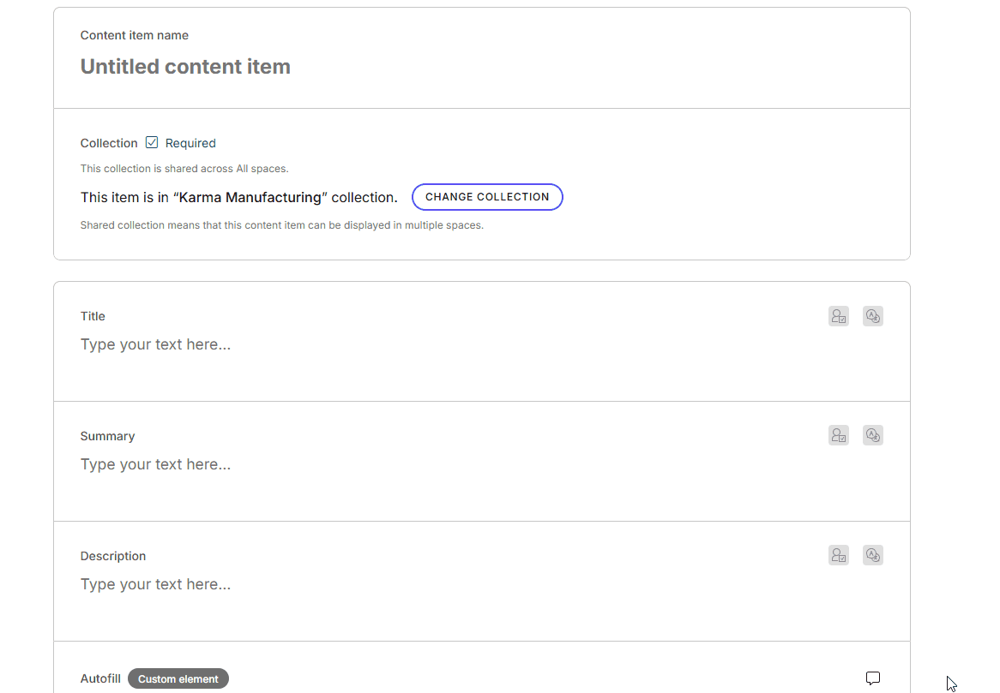

# Auto fill

This is a [custom element](https://kontent.ai/learn/docs/custom-elements) for [Kontent by Kentico](https://kontent.ai) that generates auto fills element based on another element or the name of content item. 



# Getting Started

To start the development server run:
- `npm ci` - install dependencies
- `npm run dev` - start the development server usually on https://localhost:5173 (the port can be different if 5173 is already in use)
- The `npm run dev` generates a self-signed certificate for the development server.
  Open the URL in a browser and proceed to the website through the browser warning.
- Once you proceed, the browser will remember the exception and will not ask again. (Works in chromium-based browsers)
  Then the element will properly load in the `iframe` in Kontent.ai.
- Remember to check out the required configuration of the element in `src/customElement/config.ts` and provide the configuration in the content type.

## Setup

1. Deploy the code to a secure public host
   - See [deploying section](#deploying) for a really quick option
2. Follow the instructions in the [Kontent documentation](https://kontent.ai/learn/docs/custom-elements#a-3--displaying-a-custom-element-in-kentico-kontent) to add the element to a content model.
   - The `Hosted code URL` is where you deployed to in step 1
   - Pass the necessary parameters as directed in the [JSON Parameters configuration](#json-parameters) section of this readme.
3. Deploy your server repeater for Preview API calls (details below)

## Deploying

Netlify has made this easy. If you click the deploy button below, it will guide you through the process of deploying it to Netlify and leave you with a copy of the repository in your GitHub account as well.

[](https://app.netlify.com/start/deploy?repository=https://github.com/kontent-ai-presales-engineering/custom-element-autofill)

## JSON Parameters

You need to specify the `repeater` URL, `generates_from`, and `codename` parameters to make the element work. The `config_name` element is where the content item name will be filled in. Additionally, you can use the `source` and `target` parameters to copy values from one element to another. There are also optional `force_uniqueness` and `restricted_chars` parameters:

```json
{
  "nameElement": "title",
  "sourceElement": "title",
  "targetElement": "custom_slug",
  "previewApiKey": "your_preview_api_key",
  "managementApiKey": "your_management_api_key"
}
```
  - `nameElement` -> The codename of the element where the content item name will be filled in.
  - `sourceElement` -> The codename of the source text or richt text element from which the value will be used for the target element.
  - `targetElement` -> The codename of the target text or richt text element element where the value will be filled in of the source element.
  - `previewApiKey` -> Your Preview API key.
  - `managementApiKey` -> Your Management API key.

## Security

### Warning

Never store your API keys or any other sensitive data in the JSON parameters field. It's not secure! Use server-side proxy to store sensitive data. Refer to the [Kontent.ai documentation](https://kontent.ai/learn/docs/custom-elements#a-3--displaying-a-custom-element-in-kentico-kontent) for more details on how to securely manage your API keys and other sensitive information.